# 🕒 KMP Exercise Timer

**A beautifully crafted cross-platform timer app** built with **Kotlin Multiplatform (KMP)** — designed for workouts, focus, and flow.

---

## 🚀 Overview

**KMP Exercise Timer** brings multiple specialized timers together in a single, elegant interface — running natively on **Android, iOS, and Desktop** through **Kotlin Multiplatform**.

From workouts to Pomodoro sessions to daily flow tracking, it’s built to help you manage time intuitively, across all your devices.

---

## ⏰ Timer Modes

| Timer Type | Description |
|-------------|-------------|
| **Countdown Timer** | A precise and flexible countdown — perfect for focused work or rest periods |
| **Alarm Clock** | Simple, reliable alarms with reminder + alarm states |
| **Stopwatch Clock** | Clean lap tracking and elapsed time recording |
| **Time Flow** | Continuously measures your total flow time throughout the day |
| **Tomato Timer** | Pomodoro-style focus sessions with automatic breaks |
| **Workout Timer** | Designed for gym rest and repetition tracking |

---

## ✨ Key Features

- 🧩 **Multi-Mode Timing System** — switch seamlessly between different timer types
- 🔔 **Dual Reminder & Alarm Logic** — with mute and active state handling
- 💾 **Local Persistence** — built on Room (Android) with KMP shared logic
- 🧠 **Smart Time Representation** — dynamic unit display and adaptive label positioning
- 🔄 **Resilient State Management** — timers persist through sleep or app restarts
- 💡 **Composable Multiplatform UI** — powered by Jetpack Compose across platforms
- 🏗️ **Cross-Platform Core** — shared logic for Android, iOS, and Desktop

---

## 🧩 Tech Stack

| Layer | Technology |
|-------|-------------|
| **Language** | Kotlin Multiplatform (KMP) |
| **UI Framework** | Jetpack Compose Multiplatform |
| **Database** | Room (Android) / SQLite (native targets) |
| **Async & State** | Kotlin Coroutines + Flow |
| **Build System** | Gradle Kotlin DSL |
| **Architecture** | MVVM + Shared KMP Modules |
| **Platforms** | Android, iOS, Desktop (Compose for Desktop) |

---

## 📸 Screenshots

### ⏱️ Timer Modes Overview

  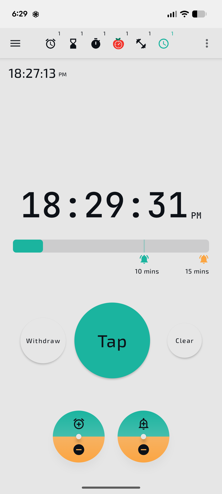
  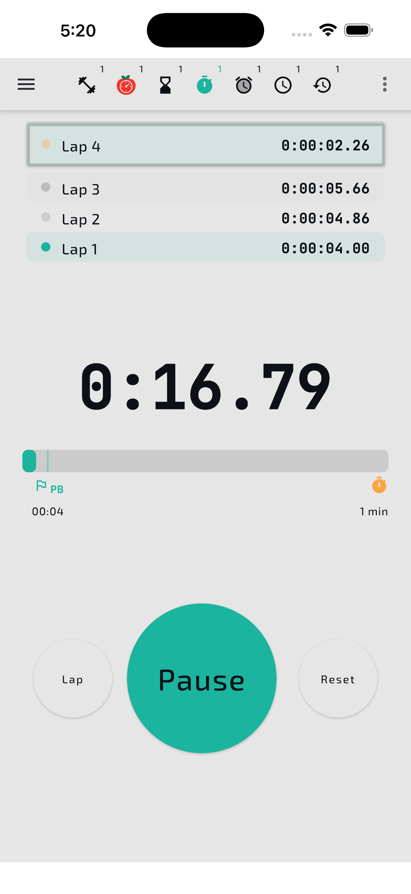
  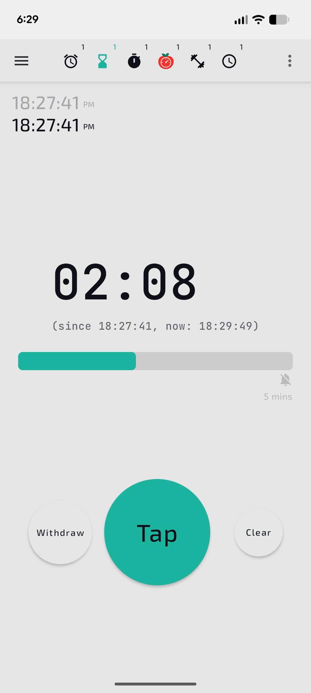
  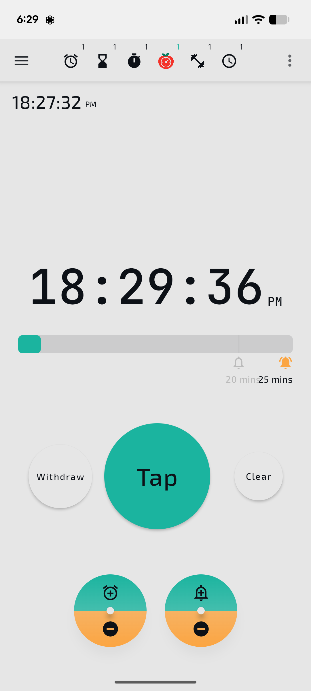
  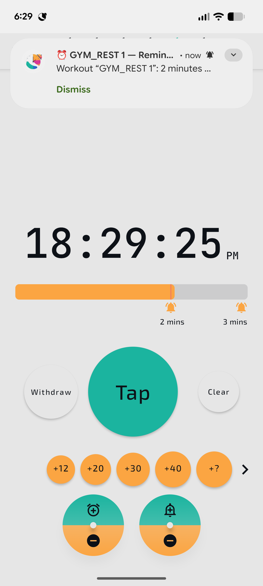

---

### ⏰ Alarm Clock Screens

  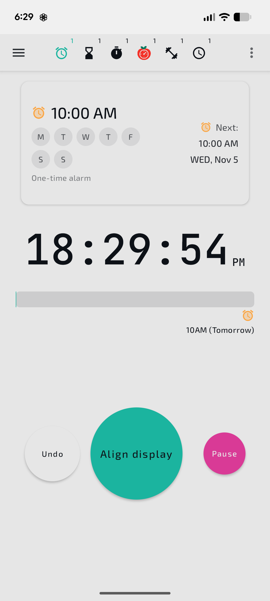
  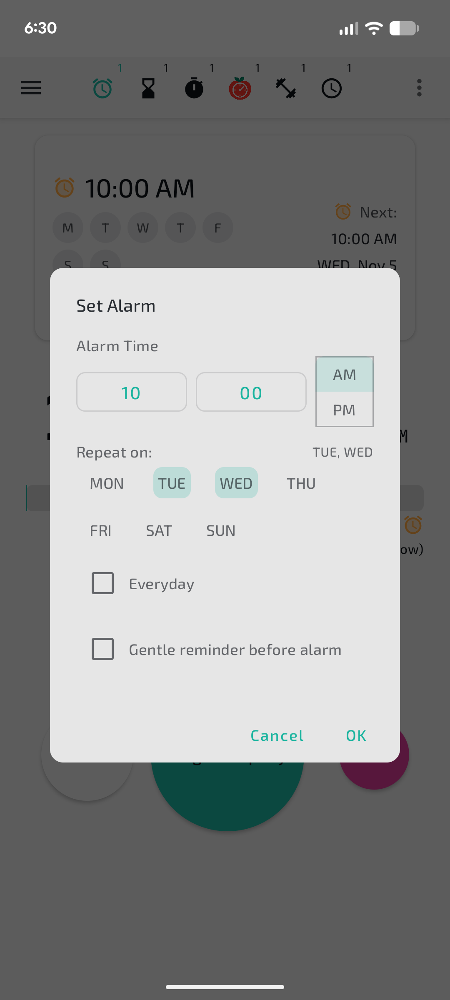
  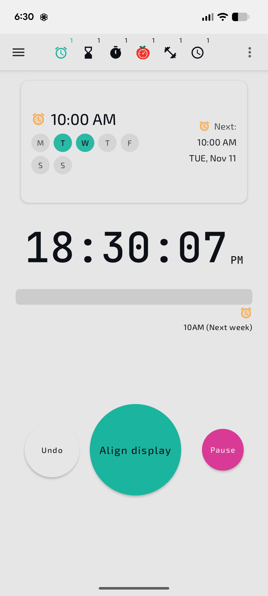

---

### 🧭 Navigation & Timer List

  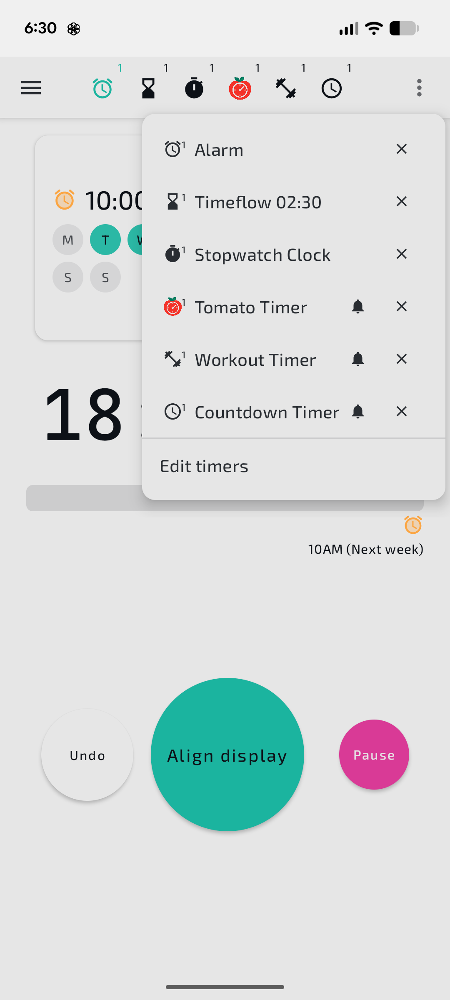
  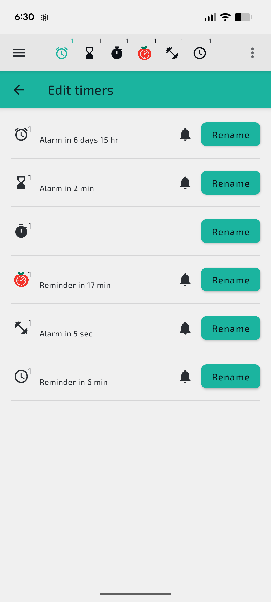
  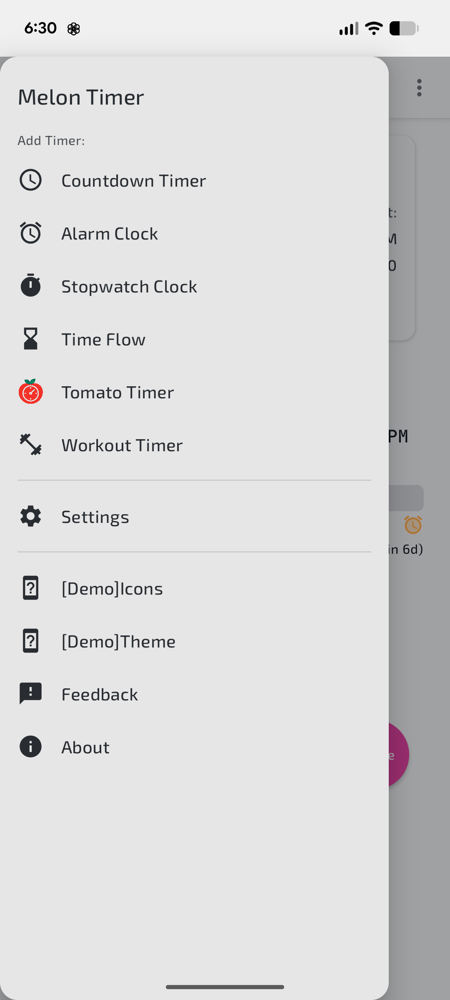

---

## 🎥 Demo Video

🎬 **Watch the app in action:** [YouTube Demo (Coming Soon)](https://youtube.com/)

---

## 📦 Download

| Platform | Package | Link |
|-----------|----------|------|
| **Android (APK)** | `kmp-exercise-timer-vX.Y.Z.apk` | [Download Latest Release](https://github.com/yourname/kmp-exercise-timer-release/releases) |
| **iOS (TestFlight)** | Coming soon |  |
| **Desktop (macOS/Windows/Linux)** | Planned |  |

---

## 💬 Feedback & Issues

You can **send feedback directly from within the app**, which links to this issue tracker.  
Or submit feedback manually here:

👉 [**Open an Issue**](https://github.com/yourname/kmp-exercise-timer-release/issues)

When reporting issues, please include:
- App version (e.g. `v1.2.0`)
- Platform (Android / iOS / Desktop)
- Description or screenshots

---

## 🧑‍💻 About This Repository

This repository hosts the **public release and documentation** of the private project `kmp-exercise-timer`.  
It includes:
- App overview and visuals
- Release APKs and changelogs
- User feedback (via GitHub Issues)
- Technical summaries of the app’s architecture

> ⚙️ The full source code remains private — this repo focuses on the product and its evolution.

---

## 🏗️ Roadmap

- [ ] iOS TestFlight release
- [ ] Desktop builds
- [ ] Improved Flow visualization
- [ ] Cloud sync for multi-device timers
- [ ] Open technical article on KMP architecture

---

### 🫶 Support
If you enjoy the app, consider **starring the repository** 🌟 —  
it helps others discover it and supports ongoing development.

---

**© 2025 Melon Studio**  
_Built with Kotlin Multiplatform. Timed for life._
