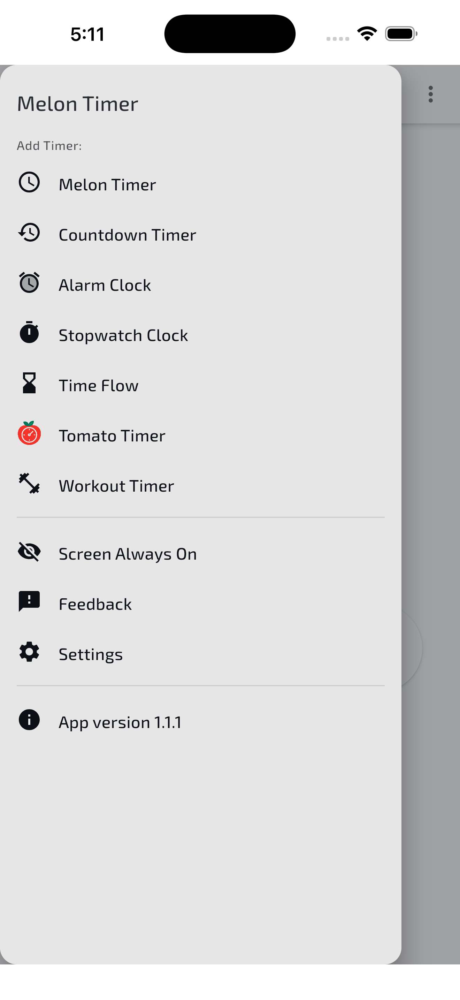
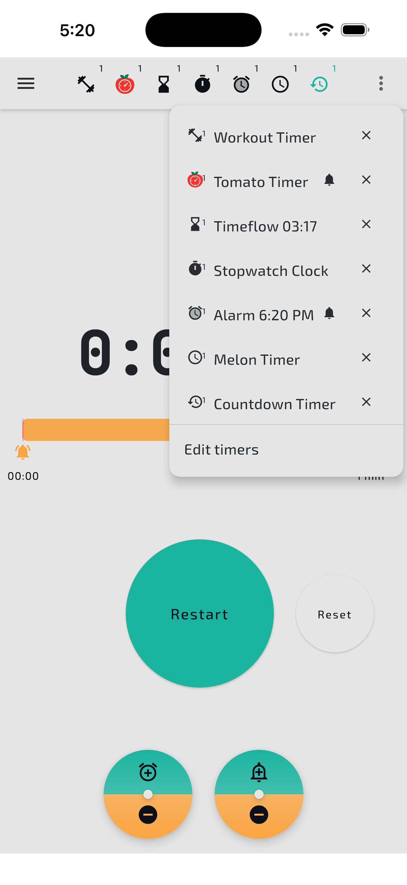
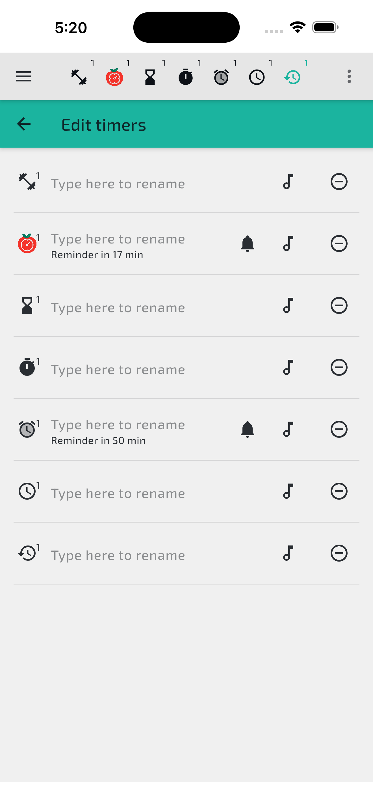
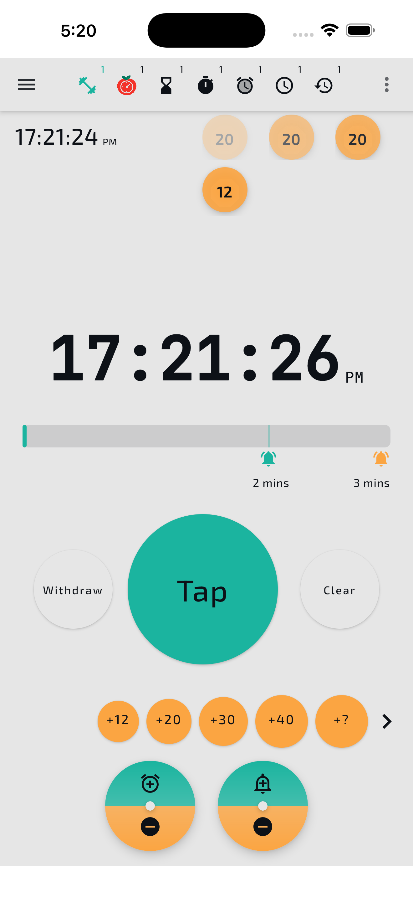
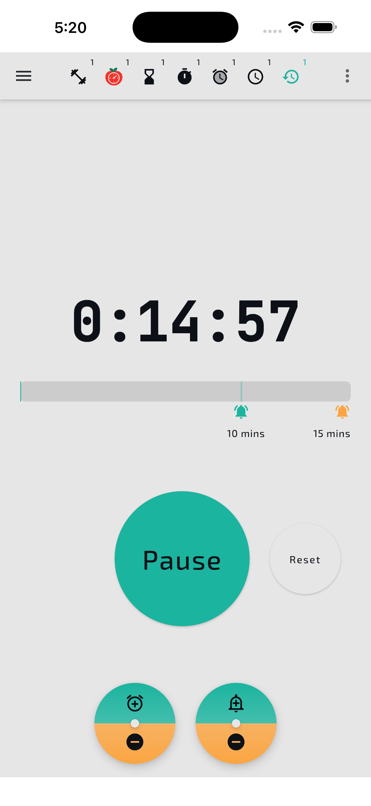
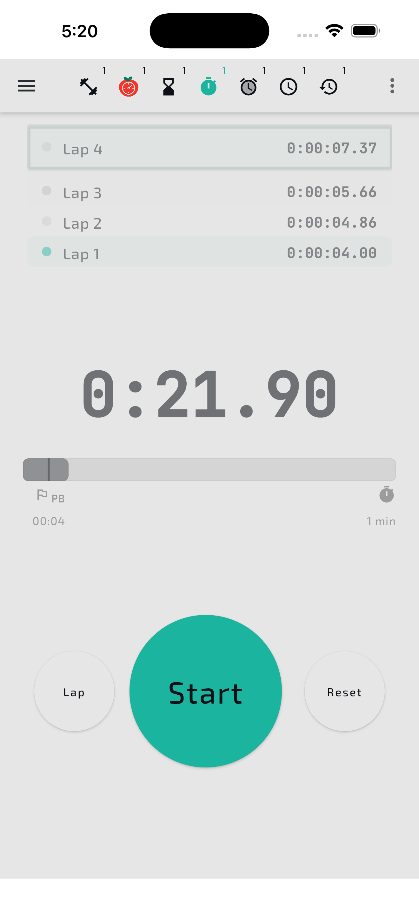
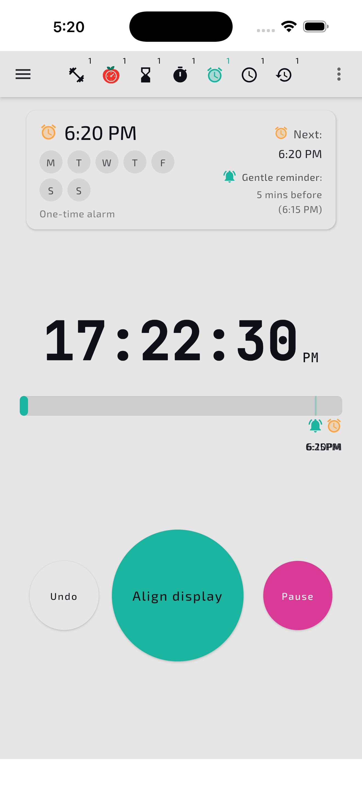
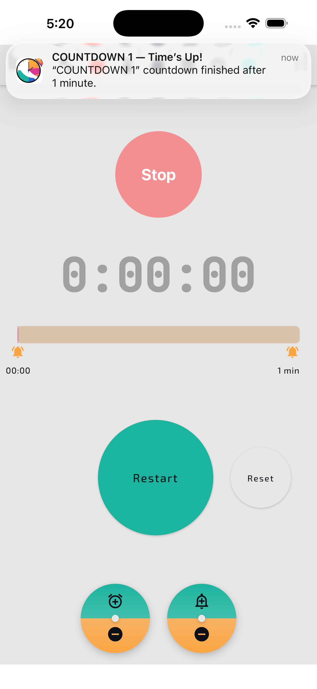
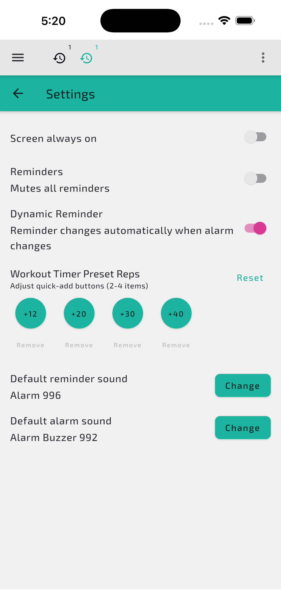

# 🍉 Melon Timer

**A beautifully crafted cross-platform timer app** built with **Kotlin Multiplatform (KMP)** — designed for workouts, focus, and flow.

---

## 🚀 Overview

**Melon Timer** brings multiple specialised timers together in a single, elegant interface — running natively on **Android, iOS, and Desktop** through **Kotlin Multiplatform**.

From workouts to Pomodoro sessions to daily flow tracking, it's built to help you manage time intuitively, across all your devices.

> Current version: **v1.1.1**

---

## ⏰ Timer Modes

| Timer Type | Description |
|------------|-------------|
| **Countdown Timer** | A precise and flexible countdown — perfect for focused work or rest periods |
| **Alarm Clock** | Simple, reliable alarms with gentle reminder + alarm states, repeatable by weekday |
| **Stopwatch Clock** | Clean lap tracking with PB (personal best) marker and elapsed time recording |
| **Time Flow** | Continuously measures your total flow time throughout the day |
| **Tomato Timer** | Pomodoro-style focus sessions with automatic breaks |
| **Workout Timer** | Designed for gym rest and repetition tracking with quick-add rep buttons |

---

## ✨ Key Features

- 🧩 **Multi-Mode Timing System** — switch seamlessly between all timer types from the top tab bar
- 🔔 **Dual Reminder & Alarm Logic** — gentle reminder fires before the main alarm (e.g. 5 mins early), with mute and active state handling
- 📍 **Visual Progress Bar** — shows elapsed time with reminder and alarm markers pinned on the bar
- 💾 **Local Persistence** — built on Room (Android) with KMP shared logic; timers survive app restarts
- 🏋️ **Workout Quick-Add** — tap preset rep buttons (+12, +20, +30, +40) or add custom ones in Settings
- 🎵 **Per-Timer Custom Sounds** — set individual reminder and alarm sounds per timer from the Edit screen
- 🔄 **Resilient State Management** — timers persist through sleep or app restarts
- 🖥️ **Screen Always On** — keep display awake during active sessions
- 💡 **Composable Multiplatform UI** — powered by Jetpack Compose across platforms
- 🏗️ **Cross-Platform Core** — shared logic for Android, iOS, and Desktop

---

## 📸 Screenshots

### 🗂️ Navigation

  
  
  

---

### ⏱️ Timers in Action

  
  
  
  

---

### ⏰ Alarm & Notifications

  
  

---

### ⚙️ Settings

  

---

## 🎥 Demo Video

🎬 **Watch the app in action:** [YouTube Demo (Coming Soon)](https://youtube.com/)

---

## 📦 Download

| Platform | Version | Link |
|----------|---------|------|
| **Android (APK)** | v1.1.1 | [Download Latest Release](https://github.com/yourname/melon-timer/releases) |
| **iOS (App Store)** | v1.1.1 | Coming soon |
| **Desktop (macOS/Windows/Linux)** | — | Planned |

---

## 🧩 Tech Stack

| Layer | Technology |
|-------|-----------|
| **Language** | Kotlin Multiplatform (KMP) |
| **UI Framework** | Jetpack Compose Multiplatform |
| **Database** | Room (Android) / SQLite (native targets) |
| **Async & State** | Kotlin Coroutines + Flow |
| **Build System** | Gradle Kotlin DSL |
| **Architecture** | MVVM + Shared KMP Modules |
| **Platforms** | Android, iOS, Desktop (Compose for Desktop) |

---

## 💬 Feedback & Issues

You can **send feedback directly from within the app** via the Feedback menu item in the side drawer.
Or submit feedback manually here:

👉 [**Open an Issue**](https://github.com/yourname/melon-timer/issues)

When reporting issues, please include:
- App version (visible in the side drawer, e.g. `App version 1.1.1`)
- Platform (Android / iOS / Desktop)
- Description or screenshots

---

## 🧑‍💻 About This Repository

This repository hosts the **public release and documentation** of Melon Timer.
It includes:
- App overview and visuals
- Release APKs and changelogs
- User feedback (via GitHub Issues)
- Technical summaries of the app's architecture

> ⚙️ The full source code remains private — this repo focuses on the product and its evolution.

---

## 🫶 Support

If you enjoy the app, consider **starring the repository** 🌟 —
it helps others discover it and supports ongoing development.

---

**© 2026 Melon Studio**
_Built with Kotlin Multiplatform. Timed for life._
